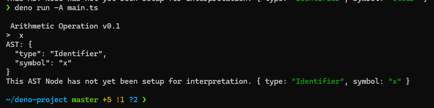

# Advisense Case Study-minimal Domain-Specific Language (DSL)

This project implements a  DSL to evaluate  mathematical expressions using an Abstract Syntax Tree (AST). It supports numeric literals, basic arithmetic operations, and includes enhanced error handling and can be expaned to handle multipule statments in future.

## Features
- **Core Requirements**:
  - Numeric literals (`BinaryOperationNode ASTNode`).
  - Basic arithmetic operations (`+`, `-`, `*`, `/`) via `BinaryOperationNode`.
  - Nested expressions.
  - Error handling
  - comparison operations(`>`, `<`, `==`, `>=`)


## Installation


### Installing Deno on Linux

```bash
 curl -fsSL https://deno.land/install.sh | sh
```

Deno offers native support for TypeScript, eliminating the need for external configuration or compilers. It also includes a built-in testing framework and a code formatter, providing a comprehensive development environment without relying on third-party libraries.

###  To Run the application
```bash
 deno run -A main.ts
```

## Documentation
### Complex arithmetic operation for (1-2*3+4+5)


#### AST Node Visualization 


#### The Terminal


### Handle Complex Brackets ((3 * 2)-(5 * 2)+ (3*1))


### Handle Compression


#### 3-1>2-1


#### Can be implemented other operations in future



### Test Cases
Test cases can be run following command
```bash
 deno test
```


## Appendix
AST Explore
https://astexplorer.net/

Abstract Syntax Tree
https://openprocessing.org/sketch/2222604/

Deno
https://deno.com/

### ChatGpt

- building documentation 
- handling test cases and exceptions suggestions
- adding comments in code

